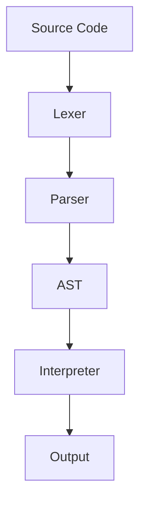

# NaijaScript Interpreter

> **For contributors and maintainers.** This is a technical design summary, not a user manual or README. For usage, see [README](./README.md).

## Quick Overview

- **Goal:** Simple, expressive scripting for learning and automation, with a Naija (Nigerian) flavor.
- **Audience:** Rust developers, language hackers, and contributors.
- **Philosophy:** Approachable, experimental, and open to breaking changes.

## Architecture (How it Works)

```
Source Code → Lexer → Parser → AST → Interpreter → Output
```

- **Lexer:** Tokenizes input, supports multi-word keywords, gives Pidgin-English errors.
- **Parser:** Builds AST with recursive descent and Pratt parsing for expressions.
- **AST:** Strongly-typed Rust enums/structs for statements, expressions, and conditions.
- **Interpreter:** Walks the AST, manages stack-based variable scopes, prints output.

## Key Design Points

| Area          | Approach/Notes                                         |
| ------------- | ------------------------------------------------------ |
| Variables     | Stack of hashmaps (block scoping)                      |
| Values        | Only `Number (f64)` for now; extensible for more types |
| Error Msgs    | Pidgin English, with line/column context everywhere    |
| Security      | No file/system access from scripts                     |
| Testing       | Unit/integration/error-injection tests in codebase     |
| Extensibility | AST/interpreter designed for new types and features    |

## What’s Not Here (Yet)

- Strings, booleans, arrays (planned)
- User-defined functions
- Advanced diagnostics
- Optimizations for heavy computation

## Contributing & Maintenance

- This doc is version-controlled with the codebase.
- Update it with any major design/code changes.
- For deep rationale, see code comments and commit messages.

## Visual: Data Flow



_For details, see the code. For user docs, see [README](./README.md). For questions, open an issue or ask in discussions._
