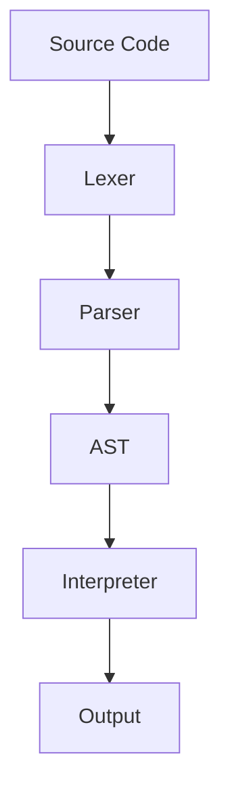

# NaijaScript Interpreter – Design Document

> **Audience:** Contributors and maintainers.  
> **Purpose:** Technical design summary for NaijaScript’s interpreter and toolchain.  
> **Scope:** Architecture, key decisions, extensibility, and maintenance.

## 1. Architecture Overview

- **Lexer:** Tokenizes input, supports multi-word keywords, Pidgin-English errors.
- **Parser:** Builds AST via recursive descent and Pratt parsing.
- **AST:** Strongly-typed Rust enums/structs for statements, expressions, conditions.
- **Interpreter:** Walks AST, manages stack-based variable scopes, prints output.

## 2. Key Design Decisions

| Area          | Approach/Notes                                         |
| ------------- | ------------------------------------------------------ |
| Variables     | Stack of hashmaps (block scoping)                      |
| Values        | Only `Number (f64)` for now; extensible for more types |
| Error Msgs    | Pidgin English, with line/column context everywhere    |
| Security      | No file/system access from scripts                     |
| Testing       | Unit/integration/error-injection tests in codebase     |
| Extensibility | AST/interpreter designed for new types and features    |

> **Why:** Simplicity, safety, and a fun, approachable learning tool.

## 3. Extensibility & Limitations

**Not yet supported:**

- Strings, booleans, arrays
- User-defined functions
- Advanced diagnostics
- Optimizations for heavy computation

**Extending:**

- To add a new value type or AST node, update `src/syntax/ast.rs` and extend the interpreter logic in `src/interpreter.rs`.

## 4. Testing & Quality

- Tests are in the codebase (see `src/` and `examples/`).
- Run all tests with `cargo test`.
- Example scripts can be run via the interpreter.

## 5. Contribution & Maintenance

- This doc is version-controlled with the codebase.
- Update with any major design/code changes.
- For deeper rationale, see code comments and commit messages.
- For questions, open an issue or start a discussion.

## 6. References

- [src/syntax/ast.rs](../src/syntax/ast.rs) – AST definitions
- [src/interpreter.rs](../src/interpreter.rs) – Interpreter logic
- [examples/](../examples/) – Example scripts

_For questions, open an issue or discussion._
